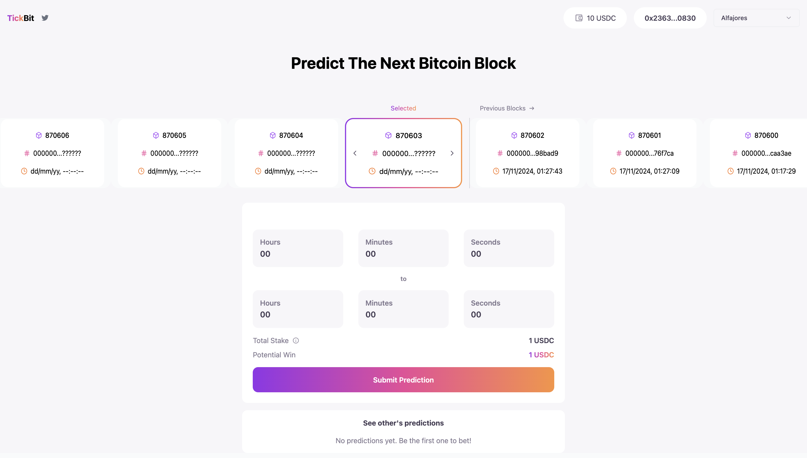
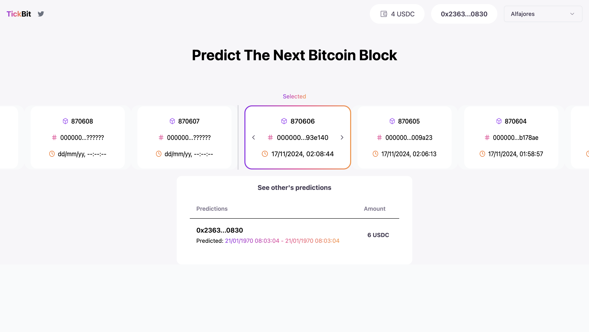
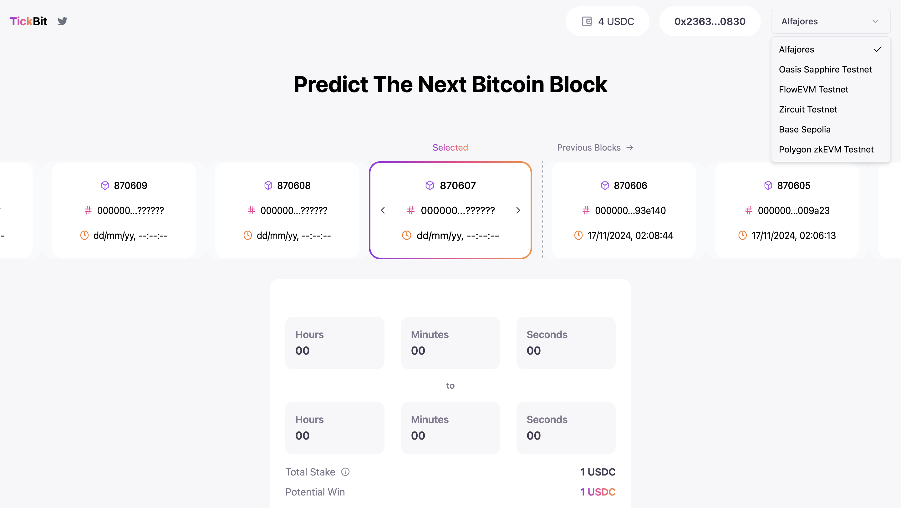

<div align="center">
  <a href="https://github.com/yash25198/TickBit">
    
  </a>

  <p align="center">
    Verifiable Compression Block Proofs with Zero Knowledge and Signed Exchanges
  </p>
</div>

# Table of Contents

  <ol>
    <li><a href="#about-project">About Project</a></li>
    <li><a href="#screenshots">Screenshots</a></li>
    <li><a href="#key-features">Key Features</a></li>
    <li><a href="#project-setup">Project Setup</a></li>
    </li>
  </ol>

</br>

# About Project

TickBit introduces an engaging betting mechanism where users can wager on the precise interval in which a Bitcoin block will be mined. Here's how it works:

1. **User Bets**: Participants place bets predicting the timestamp closest to the one hashed in the Bitcoin block header.
2. **Relayer Proofs**: Relayers, acting as verifiable intermediaries, generate cryptographic proofs that a valid Bitcoin block has been indexed by the indexer (e.g., [cryptoid.info](https://cryptoid.info)).
3. **Determine the Winner**: The bet closest to the actual mined timestamp wins, verified through provable inclusion of the block hash.
   TickBit showcases the power of verifiable data integrity and ZKP to make decentralized betting seamless, transparent, and trustless.

<p align="right">(<a href="#table-of-contents">back to top</a>)</p>

# Screenshots

<p float="left">
  
   
  
</p>

<p align="right">(<a href="#table-of-contents">back to top</a>)</p>

# Key Features

## Signed Exchanges (SXG)

TickBit leverages Google’s SXG protocol to ensure privacy-preserving prefetched content verification. SXG enables relayers to fetch critical resources (like HTML, JavaScript, or Bitcoin block hashes) from a website while ensuring authenticity through:

-   **Verification of SXG Signatures**: Using the server’s `secp256r1` TLS certificate. Contracts for verification can be found here : https://github.com/crema-labs/sxg-sp1/blob/feat-bitbet/contracts/src/Sxg.sol
-   **Content Integrity Validation**: Via the MICE (Merkle Integrity Content Encoding) standard and the `mi-sha256` hash function.

This guarantees the content retrieved from [cryptoid.info](https://cryptoid.info) is cryptographically verified off-chain before generating a proof.

## Zero-Knowledge Proofs (ZKP)

TickBit implements **zk-SNARKs (Groth16)** for verifiable compression, reducing expensive on-chain operations to a single `160-byte` proof. This makes on-chain verification both efficient and cost-effective, even when dealing with large datasets like web responses.

Applications of ZKP in TickBit:

-   **Verifiable Compression**: Ensures that the proof of a block's inclusion is constant-sized, regardless of the webpage’s data size.
-   **Optional Privacy**: ZKP circuits can be extended to enable private bets or private verification of transaction details within the Bitcoin block.

## Integrity Hash Generation

For proof generation, the platform uses the `mi-sha256` algorithm:

-   Integrity for all records (except the last) is generated as:

```
proof(r[i]) = SHA-256(r[i] || proof(r[i+1]) || 0x1)
```

-   For the last record:

```
proof(r[last]) = SHA-256(r[last] || 0x0)
```

This ensures that every element in the data stream is cryptographically linked to the final proof.

<p align="right">(<a href="#table-of-contents">back to top</a>)</p>

# Project Setup

## Frontend

1. Install `pnpm`.
2. Build the project with `pnpm build`
    > Make sure to have the backend running before starting the frontend and correctly set in config.json.
3. Start the frontend with `pnpm serve`.

## Backend

1. Install `go`.
2. Run `go mod tidy`
3. Add Priv_key with gas on the required chain and `SP1_PRIVATE_KEY` for prover net access in config.json
4. Terminal 1 : `go run ./cmd/server.go`
5. Terminal 2 : `go run ./cmd/relay/relay.go`

<p align="right">(<a href="#table-of-contents">back to top</a>)</p>

<p align="center">Made with ❤️ at ETH Bangkok</p>
